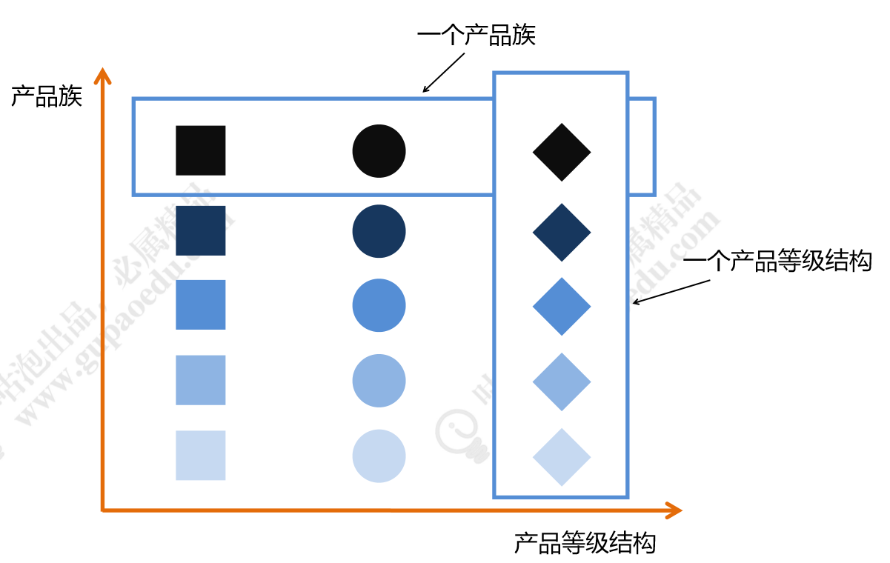
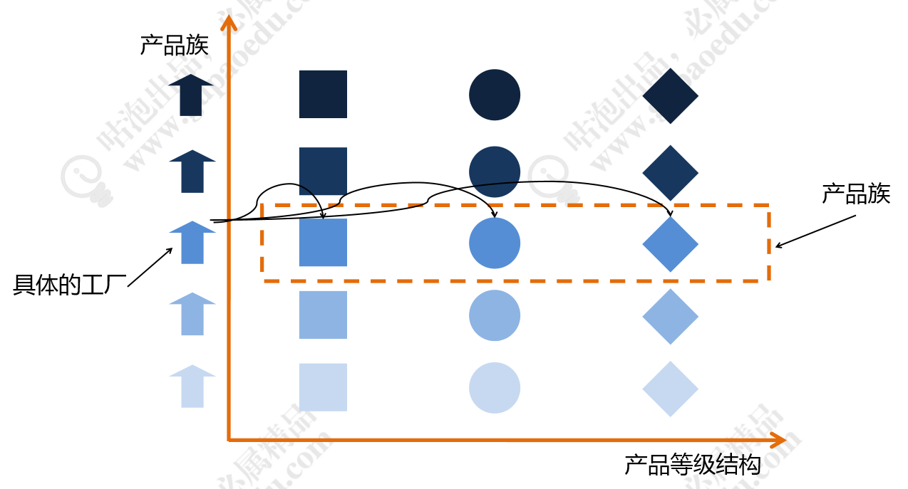

## 设计模式（Design pattern） - 抽象工厂模式（Abastract Factory Pattern）

### 1. 抽象工厂模式定义

抽象工厂模式（AbastractFactory Pattern）是指提供一个创建一系列相关或相互依赖对象的接口，无须指定他们具体的类。客户端（应用层）不依赖于产品类实例如何被创建、实现等细节，强调的是一系列相关的产品对象（属于同一产品族）一起使用创建对象需要大量重复的代码。需要提供一个产品类的库，所有的产品以同样的接口出现，从而使客户端不依赖于具体实现。

讲解抽象工厂之前，我们要了解两个概念***产品等级结构和产品族*** ，看下面的图：

从上图中看出有正方形，圆形和菱形三种图形，相同颜色深浅的就代表同一个产品族，相同形状的代表同一个产品等级结构。同样可以从生活中来举例，比如，美的电器生产多种家用电器。那么上图中，颜色最深的正方形就代表美的洗衣机、颜色最深的圆形代表美的空调、颜色最深的菱形代表美的热水器，颜色最深的一排都属于美的品牌，都是美的电器这个产品族。再看最右侧的菱形，颜色最深的我们指定了代表美的热水器，那么第二排颜色稍微浅一点的菱形，代表海信的热水器。同理，同一产品结构下还有格力热水器，格力空调，格力洗衣机。

再看下面的这张图，最左侧的小房子我们就认为***具体的工厂，有美的工厂，有海信工厂，有格力工厂。***
***每个品牌的工厂***都生产***洗衣机、热水器*** 和 ***空调***。

示例中的代码完整地描述了两个产品族Java课程和Python课程，也描述了两个产品等级视频和手记。抽象工厂非常完美清晰地描述这样一层复杂的关系。<u>但是，不知道大家有没有发现，如果我们再继续扩展产品等级，将源码 Source也加入到课程中，那么我们的代码从抽象工厂，到具体工厂要全部调整，很显然不符合开闭原则</u>。

### 2. 优缺点
<u>适合长时间不变动的场景</u>
* 抽象工厂缺点   
1. 规定了所有可能被创建的产品集合，<u>产品族中扩展新的产品困难，需要修改抽象工厂的接口</u>。
2. 增加了系统的抽象性和理解难度。

### 3. 简单工厂 vs 工厂方法 vs 抽象工厂
* 简单工厂：产品的工厂
* 工厂方法：工厂的工厂
* 抽象工厂：复杂产品的工厂

* 简单工厂：工厂是一个实体类，内部直接根据逻辑创建对应的产品。
* 工厂方法：工厂首先有个接口定义规范。不同的产品使用不同的实体类工厂根据规范和需求创建对应的产*品。这就是它们的区别。
* 工厂方法是生产一类产品，抽象工厂是生产一个产品族

### 参考地址
* [设计模式总览及工厂模式详解](https://www.jianshu.com/p/808d44951ad5)
    
