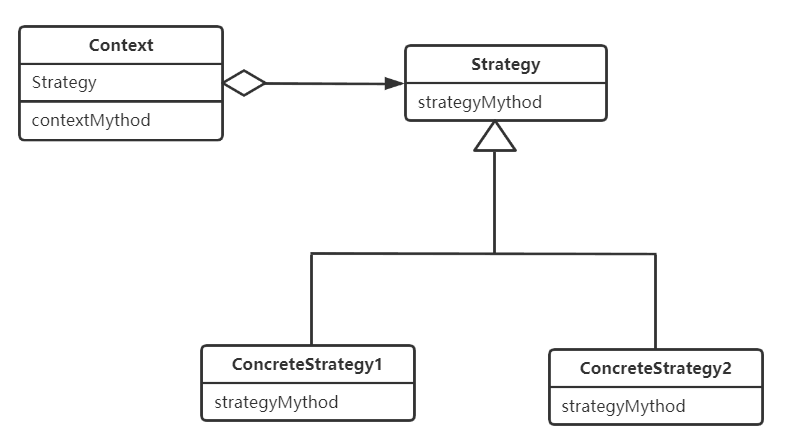
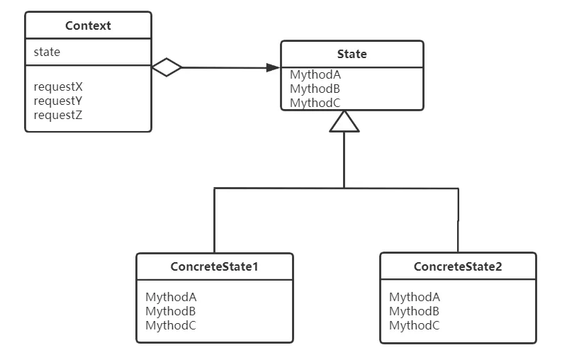

## 设计模式（Design pattern） - 策略模式（Strategy pattern）

### 1. 策略模式
策略指的是计策、谋略，而模式一般指人为整理而成的，在某种场景下重复发生的问题的解决办法。在编程中，我们可以把策略看做是“算法”，而策略模式，按照GoF的定义，就是我们设计一些算法，把它们封装起来，让它们可以相互替换，这样就可以轻松地切换不同的算法来解决同一个问题。

 我们看一下策略模式中有哪些角色。

* Strategy（策略）Strategy角色负责决定实现策略所必需的接口（API）。在示例程序中，由strategy接口扮演此角色。

* ConcreteStrategy（具体的策略）ConcreteStrategy角色负责实现Strategy角色的接口（API），即负责实现具体的策略（战略、方向、方法和算法）。

* Context（上下文）负责使用Strategy角色。Context角色保存了ConcreteStrategy角色的实例，并使用ConcreteStrategy角色去实现需求（总之，还是要调用Strategy角色的接口（API））。

### 2. 注解或配置方式实现思考
想更符合开闭原则，并对反射有一定了解，那还可以通过反射来避免对类的修改。

可以通过一个配置文件或者定义一个注解来标注定义的策略类；通过读取配置文件或者搜索被标注的策略类，通过反射动态地加载这些策略类、创建策略对象；当我们新添加一个策略的时候，只需要将这个新添加的策略类添加到配置文件或者用定义的注解标注即可。

### 3. 策略模式的使用场景
 * 一个项目中有许多类，它们之间的区别仅在于它们的行为，希望动态地让一个对象在许多行为中选择一种行为时；   
 * 一个项目需要动态地在几种算法中选择一种时；   
 * 一个对象有很多的行为，不想使用多重的条件选择语句来选择使用哪个行为时。   

### 4. 作用或意义
策略模式不仅仅可以优化if else代码，其主要的作用还是解耦策略的定义、创建和使用，控制代码的复杂度，让每个部分都不至于过于复杂、代码量过多。除此之外，对于复杂代码来说，策略模式还能让其满足开闭原则，添加新策略的时候，最小化、集中化代码改动，减少引入 Bug 的风险。

### 5. 与状态模式（state pattern）区别

使用策略模式和状态模式都可以替换被委托对象，而且它们的类之间的关系也很相似。但是两种模式的目的不同。
在策略模式中，ConcreteStrategy角色是表示算法的类。在Strategy模式中，可以替换被委托对象的类。当然如果没有必要，也可以不替换。
而在状态模式中，ConcreteState角色是表示“状态”的类。在State模式中，每次状态变化时，被委托对象的类都必定会被替换。

### 参考地址
* [还在用 if else？试试策略模式吧](https://mp.weixin.qq.com/s?__biz=MjM5MjAwODM4MA==&mid=2650744020&idx=3&sn=5de21a1f8fed1ebfeed5fee4bde71233&chksm=bea7550789d0dc11d59a653a019570592d46516a74262aefa9eee1193aea16a197b428e00a20&mpshare=1&scene=1&srcid=0505jAJay7NmSa00CNagxAuE&sharer_sharetime=1588670508096&sharer_shareid=79ae7b62144a541c922d64c32c4afdc6&key=ee141ba91bbf96df4ffa6cb05e8fcc377c3c03cb2281888d177b8b95801e1f05e7f8bd600c6c926badeb0f089d15420b1c259376d60b4454a98f67aec7564d3df22e4b776d5f912f1d8da61f5a6a55d1&ascene=1&uin=MTU2NDAxNDYyMA%3D%3D&devicetype=Windows+10+x64&version=62090070&lang=zh_CN&exportkey=AVZGeYml4gUrVre%2B2MwU2bQ%3D&pass_ticket=kICJn3fmhTiTcQ6EYvaeA5N1SnTuAdJBO7odGVaOrDeE9U8EQxHSvt3brHOAMrtX)
    
